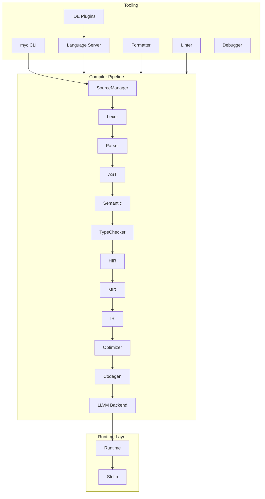

# Myc Toolchain Architecture

This document describes the high-level architecture of the Myc programming
language ecosystem. The current codebase is a **foundation layer** — scaffolding
only, with no lexer, parser, or code generation implemented yet.

## System Overview



## Module Dependency Graph

Dependencies flow in one direction. Lower layers never depend on higher layers.

```
shared
  ↑
config, diagnostics, dsa
  ↑
source
  ↑
lexer → ast
  ↑       ↑
parser ───┘
  ↑
semantic → typechecker → hir → mir → ir
                              ↑
                         optimizer
                              ↑
                          codegen → llvm_backend
                              ↑
                           backend
  ↑
frontend (wraps parser + semantic)
  ↑
driver → myc executable
```

## Core Subsystems

### CompilerDriver

The `CompilerDriver` class (`compiler/driver/`) is the orchestration entry point:

1. Parse CLI arguments via `CliParser`
2. Load `CompilerConfig`
3. Initialize `DiagnosticEngine`
4. Dispatch commands via `CommandDispatcher`
5. Return appropriate exit code

### Configuration

`CompilerConfig` aggregates all build-time settings:

- `BuildProfile` — Debug / Release / Custom
- `OptimizationLevel` — O0–O3, Os, Oz
- `TargetArchitecture` — x86_64, aarch64, wasm32, etc.
- `TargetPlatform` — linux, windows, macos, wasm
- `DiagnosticConfiguration` — warning behavior
- `GpuConfiguration` — placeholder for GPU backend
- `AiConfiguration` — placeholder for AI-assisted compilation

### Diagnostics

All compiler phases report through `DiagnosticEngine`. Diagnostics carry:

- File, line, column location
- Error code (e.g., `E0001`)
- Severity (Error, Warning, Note, Hint)
- Future fix-it hints

### Source Management

`SourceManager` loads and caches `.myc` source buffers with:

- UTF-8 validation
- Line/column index for O(log n) lookup
- Future include/import resolution

### Logging

`Logger` provides a replaceable, thread-safe logging facade with levels
TRACE through ERROR. Default sink writes to stderr.

## Build System

CMake organizes the project as independent static libraries with alias targets
(`myc::lexer`, `myc::parser`, etc.). Key properties:

- C++23 enforced via `myc_set_target_standard()`
- Warnings treated as errors via `myc_set_warnings()`
- `compile_commands.json` exported for clangd/IDE
- Debug and Release build types
- Optional sanitizers and LTO

## Future Compatibility

The architecture anticipates:

| Feature | Integration Point |
|---------|-------------------|
| LLVM backend | `compiler/llvm/` |
| Incremental compilation | `SourceManager` + per-module IR cache |
| JIT compilation | `runtime/` + LLVM ORC |
| Interpreter | `mir/` bytecode execution |
| LSP | `language-server/` |
| Package manager | `package-manager/` |
| Cross-compilation | `config::TargetArchitecture/Platform` |
| GPU backend | `backend/` + `GpuConfiguration` |
| WebAssembly | `backend/` wasm32/wasm64 targets |
| Auto-parallelization | `optimizer/` |

## Testing Strategy

A lightweight in-tree test harness (`tests/unit/myc_test.hpp`) provides
`MYC_TEST`, `MYC_ASSERT`, and `MYC_ASSERT_EQ` macros without external
dependencies. Each subsystem will gain dedicated unit tests as implementation
proceeds.

## Coding Standards

- Google C++ Style Guide (where practical)
- `enum class` over plain enums
- `constexpr` and `string_view` where applicable
- Namespaces: `myc::`, `myc::compiler::`, etc.
- No macros except test registration
- Every public class documented
- No global mutable state
